# Amanda's Birthday Quiz

Welcome to Amanda's Birthday Quiz website! This project is a personalized and interactive quiz designed to celebrate Amanda's special day. The quiz focuses on testing the knowledge of participants about Amanda's life, preferences, and memorable moments. The website provides a fun and engaging way for friends to come together and celebrate Amanda's birthday.

Feel free to customize this quiz to suit the unique personalities of your friends, family, or even coworkers. Quizzes are a delightful way to express appreciation and celebrate someone special. It's a fun and interactive way to connect with the birthday person, especially if you can't be there in person. Studies on interactive engagement and group activities suggest that people generally enjoy participating in activities that involve them actively. Quizzes, especially those tailored to the interests of the group, can promote engagement and participation. Whether it's tailored to their interests, inside jokes, or shared memories, this personalized quiz is sure to bring joy and laughter to the celebration.

Visit the deployed site: [Amanda's Birthday Quiz](https://elindalenback.github.io/birthday-quiz-project2/)

## Site Owner Goals

- Provide users with an enjoyable and engaging birthday quiz experience.
- Create a visually appealing and responsive website for users to celebrate Amanda's birthday.
- Allow users to easily navigate through the quiz, sign up or form teams, answer questions, and view their scores.
- Invoke a sense of celebration and fun, encouraging users to actively participate in the quiz.

## User Stories

- ### First Time User

  - As a first time user, I want to understand the purpose of Amanda's Birthday Quiz and how to participate.
  - As a first time user, I want to easily navigate the quiz, sign up or form a team, answer questions, and see my final score.
  - As a first time user, I want to have an enjoyable experience learning about Amanda through the quiz questions.

- ### Returning user
  
  - As a returning user, I want to reminisce and enjoy the quiz experience again.
  - As a returning user, I want to reminisce about Amanda's life and learn more about my friend.

- ### Frequent user

  - As a frequent user, I want to play the birthday quiz periodically to celebrate Amanda's birthday and have a good time.
  - As a frequent user, I want to share the quiz with friends and family to celebrate together.

## Design

Colour palette from Coolors

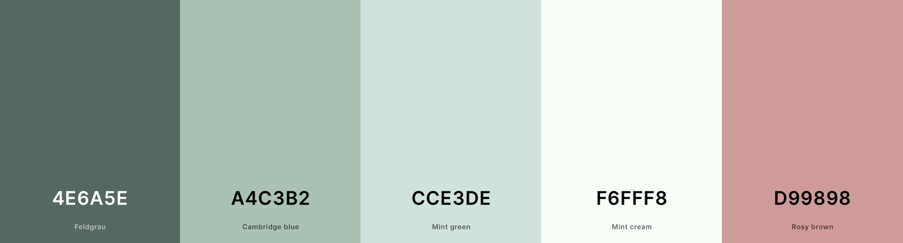

### Color Palette Description

**#4E6A5E (Dark Green):**

- **Usage:** Header Background, Footer Background
- **Description:** Creates a sense of calm and elegance, framing the quiz with a visually appealing structure.

**#A4C3B2 (Light Green):**

- **Usage:** Main Background of the Quiz Area
- **Description:** Serves as the main background for the quiz area, creating a pleasant and inviting environment for the quiz questions.

**#CCE3DE (Light Blue-Green):**

- **Usage:** Overall Background of the Main Content
- **Description:** Applied to the main content background, providing a harmonious and soothing backdrop for the entire webpage.

**#F6FFF8 (Light Mint):**

- **Usage:** Button Backgrounds, Text Color, Quiz Page Background
- **Description:** Used for button backgrounds, ensuring they stand out while maintaining a soft and inviting appearance. Also applied to text color and quiz page background for a refreshing touch.

**#D99898 (Light Salmon):**

- **Usage:** Incorrect Answer Indication in the Quiz
- **Description:** Highlights incorrect answers during the quiz, providing a noticeable visual cue.

These color choices collectively create a cohesive and visually pleasing experience for users interacting with Amanda's Birthday Quiz. The combination of greens and blues conveys a celebratory and lively atmosphere, while the mint and salmon accents add a touch of vibrancy and engagement.

### Fonts

The website employs the 'Poppins' font as the main typeface, providing a clean and modern appearance. Additionally, 'Caveat' in a cursive style is utilized for specific elements such as headers, adding an elegant and personal touch. These fonts where imported via [Google Fonts](https://fonts.google.com/).

In case there are any difficulties loading the primary fonts, the fallback 'sans-serif' is in place to ensure a legible and consistent text experience throughout the site. For the 'Caveat' font the style cursive is set to maintain the personal touch even if the font for some reason is not loading correctly.

### Layout

The site is a single page with 5 sections:

- Welcome message
- Sign up for Team
- Quiz Rules
- Quiz Game
- Score

### Wireframes

Wireframes were produced using Balsamiq.

 

Wireframe

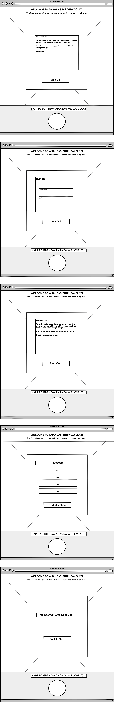
 

## Features

All aspects of the website are responsive, and the features that are consistently available include:

A favicon and a titel in the browser tab.
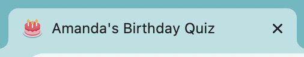

The header.

And also the footer.

All Action Buttons on pages all have hover effect to improve the userexperience.
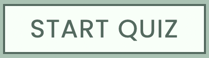
Hovered:
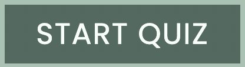

### Welcome Page

The Welcome Page warmly greets users, introducing them to the birthday quiz experience. Here's what you'll find:

- Greeting: A friendly welcome message creates a positive atmosphere.

- Introduction: Briefly explains the purpose of the website and the birthday quiz.

- "Sign Up" Button: Encourages users to start the quiz journey.

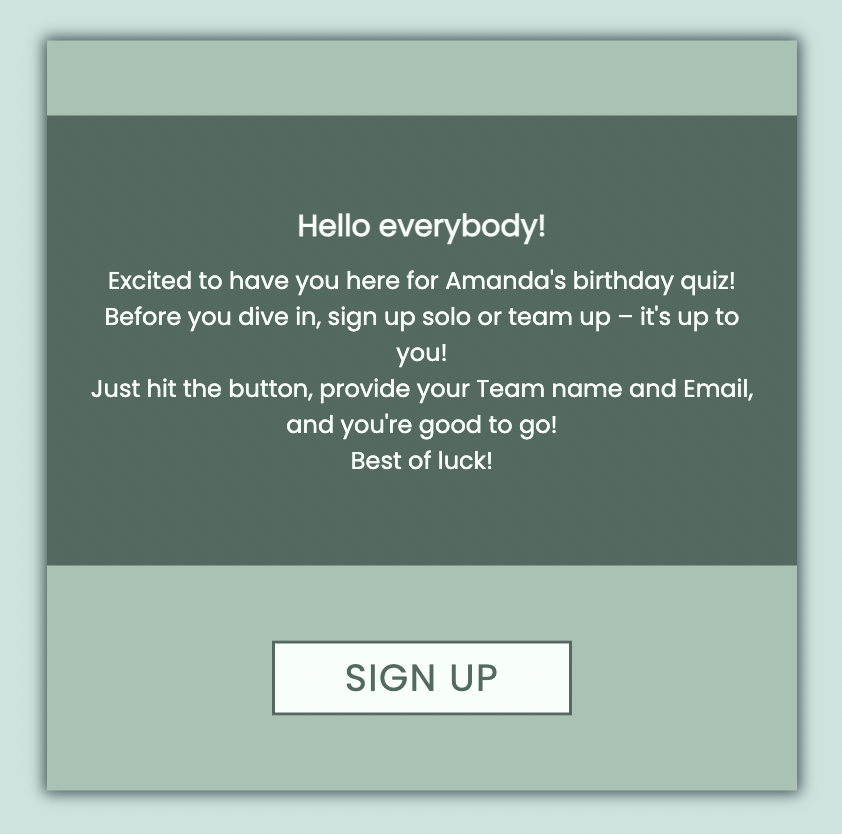

### Sign-Up Page

The Sign-Up page allows users to enter their email and team name to participate in the birthday quiz. Key features include:

- Simple form validation for email and team name.
- User-friendly error messages for invalid inputs.
- Transition to the Quiz Rules page upon successful validation.

Validation feedback:
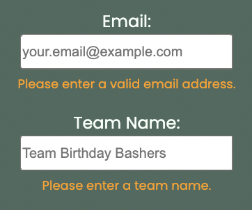

### Quiz Rules

The Quiz Rules page provides users with information about the rules before starting the quiz. Features include:

- Clear presentation of rules and guidelines for the quiz.
- Transition to the Quiz Page after reviewing the rules.

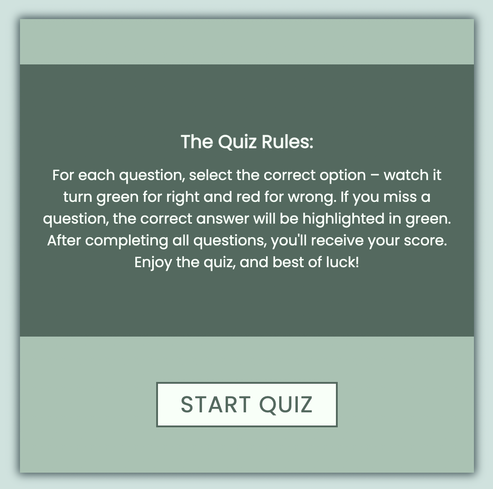

### Quiz Page

The Quiz Page engages users with a series of questions about Amanda. Notable features include:

- A set of questions with multiple-choice answers.
- Real-time feedback on selected answers.
- Transition to the final score page upon completing all questions.

Quiz Page on all devices:
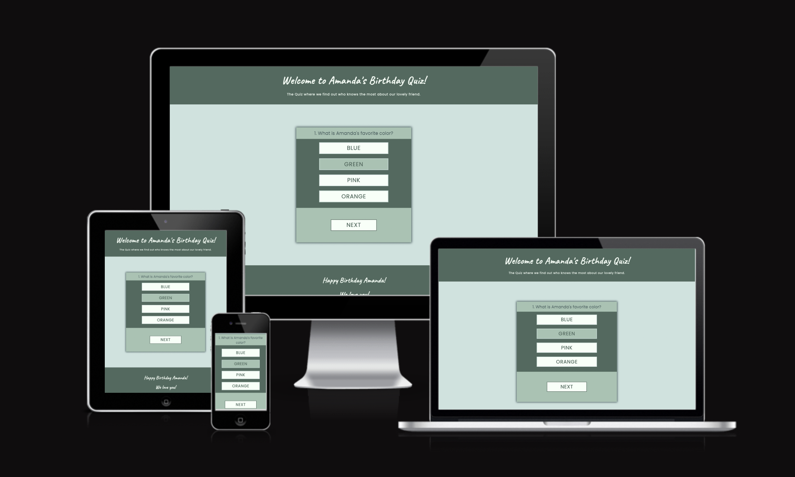

Before the user has answerd a question the next button is hidden.
Before answer:
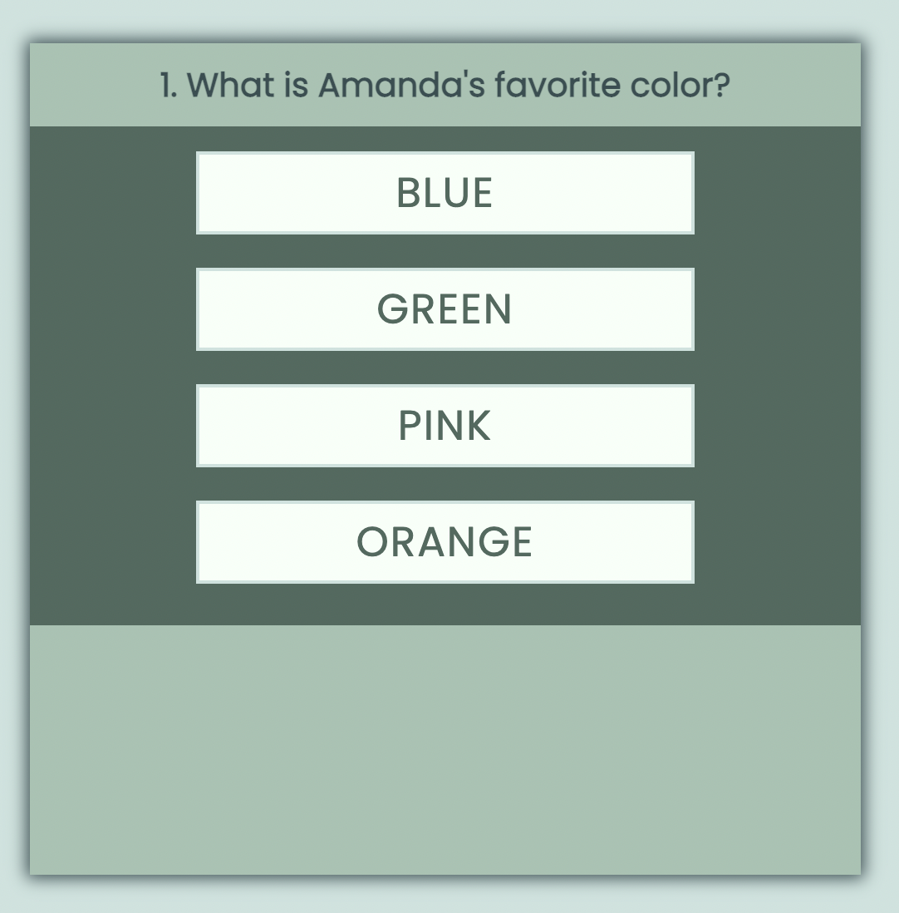

When an answer is selected the button apper and if the choosen answer button was correct the button will turn green.
Correct answer:
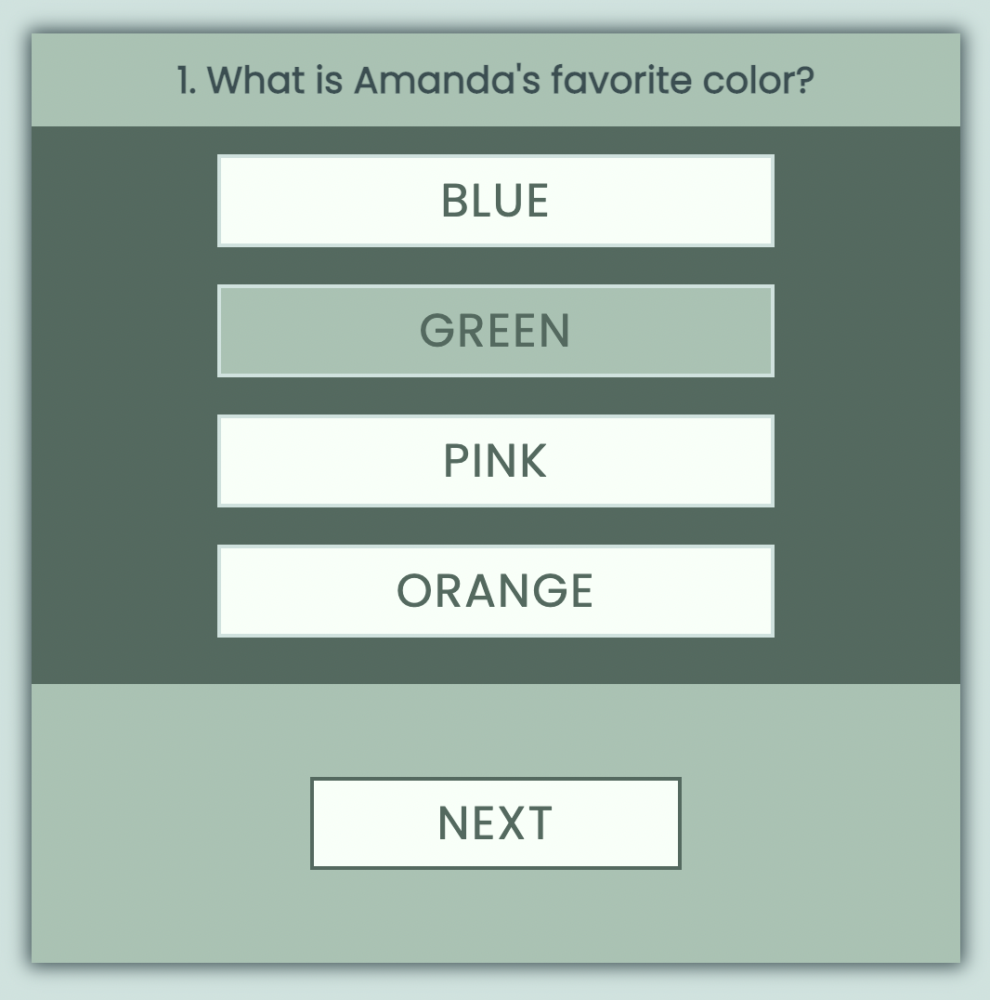

If the answer is wrong the button will turn red and the correct answer will be highlighted in green.
Wrong answer:
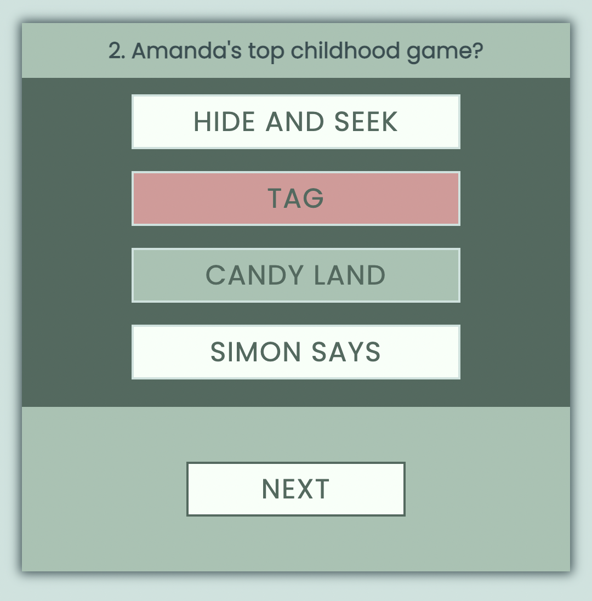

### Final Score

The Final Score page displays the user's score, including the number of correct answers. Features include:

- Storage of the team name for a personalized experience.
- User-friendly interface with a congratulatory message.
- Option to go back to start page / welcome page.

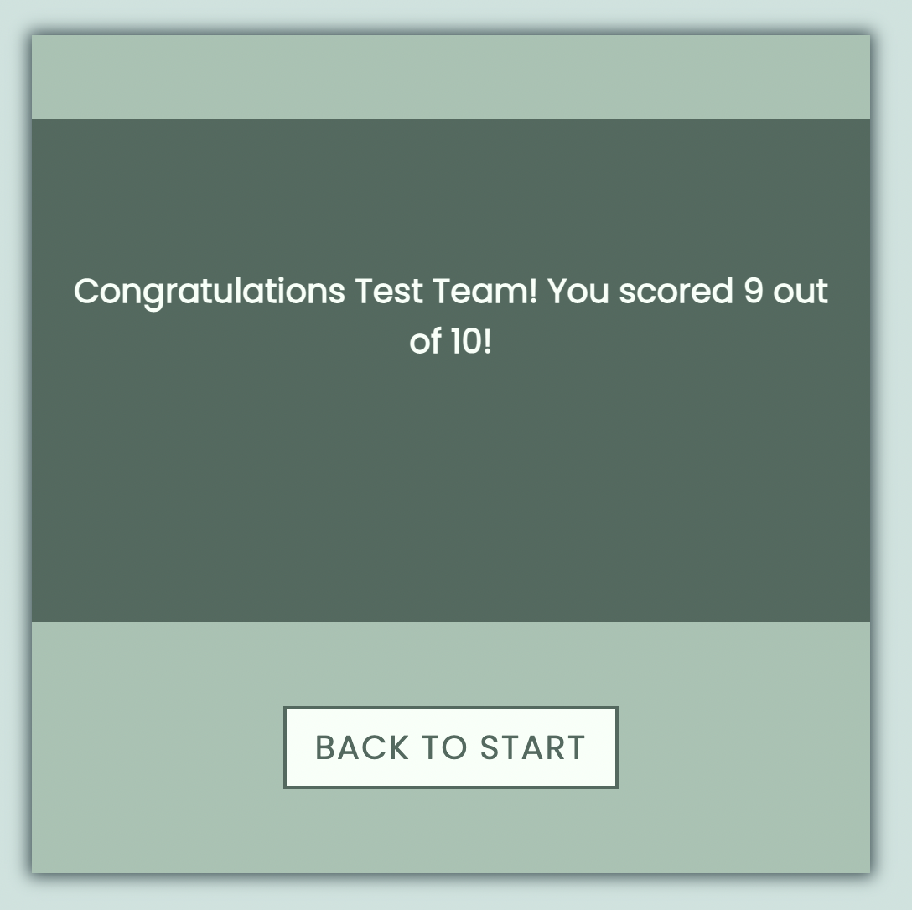

### Quiz Navigation

Throughout the quiz, users can navigate seamlessly through various stages. Key navigation features include:

- Smooth transitions between quiz sections (Welcome, Sign-Up, Quiz Rules, Quiz Page, Final Score).
- Responsive design for a consistent experience on different devices.

### Future Enhancements

- Store the team names in an array to check for duplicate entries and ensure uniqueness.
- Implement functionality to automatically send an email containing the final scores from each team, either to the quiz leader or directly to the participants.

