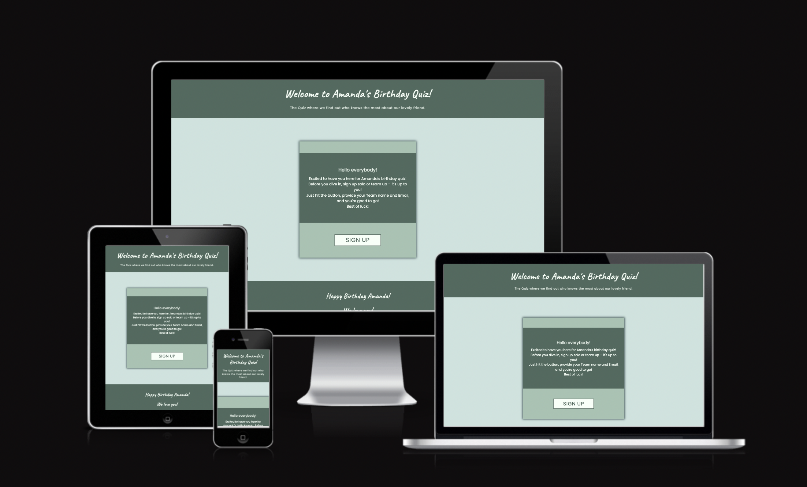

# Amanda's Birthday Quiz

Welcome to Amanda's Birthday Quiz website! This project is a personalized and interactive quiz designed to celebrate Amanda's special day. The quiz focuses on testing the knowledge of participants about Amanda's life, preferences, and memorable moments. The website provides a fun and engaging way for friends to come together and celebrate Amanda's birthday.

Feel free to customize this quiz to suit the unique personalities of your friends, family, or even coworkers. Quizzes are a delightful way to express appreciation and celebrate someone special. It's a fun and interactive way to connect with the birthday person, especially if you can't be there in person. Studies on interactive engagement and group activities suggest that people generally enjoy participating in activities that involve them actively. Quizzes, especially those tailored to the interests of the group, can promote engagement and participation. Whether it's tailored to their interests, inside jokes, or shared memories, this personalized quiz is sure to bring joy and laughter to the celebration.

Visit the deployed site: [Amanda's Birthday Quiz](https://elindalenback.github.io/birthday-quiz-project2/)

## Site Owner Goals

- Provide users with an enjoyable and engaging birthday quiz experience.
- Create a visually appealing and responsive website for users to celebrate Amanda's birthday.
- Allow users to easily navigate through the quiz, sign up or form teams, answer questions, and view their scores.
- Invoke a sense of celebration and fun, encouraging users to actively participate in the quiz.

## User Stories

- ### First Time User

  - As a first time user, I want to understand the purpose of Amanda's Birthday Quiz and how to participate.
  - As a first time user, I want to easily navigate the quiz, sign up or form a team, answer questions, and see my final score.
  - As a first time user, I want to have an enjoyable experience learning about Amanda through the quiz questions.

- ### Returning user
  
  - As a returning user, I want to reminisce and enjoy the quiz experience again.
  - As a returning user, I want to reminisce about Amanda's life and learn more about my friend.

- ### Frequent user

  - As a frequent user, I want to play the birthday quiz periodically to celebrate Amanda's birthday and have a good time.
  - As a frequent user, I want to share the quiz with friends and family to celebrate together.
